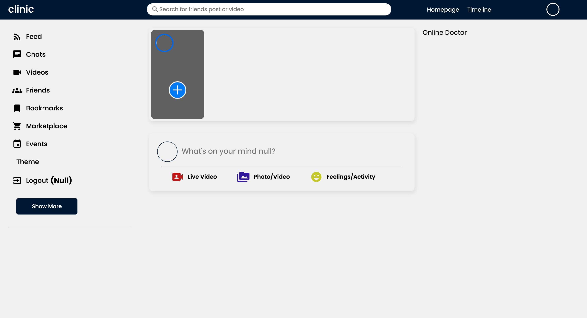

# Implementation of a social network in the field of medicine

The project is the development and launch of a platform that brings together medical professionals, patients and other healthcare participants. This social network provides an opportunity to exchange information, experience, advice and support in the field of medicine, improving the availability and quality of medical services for all participants.

# Screen:

